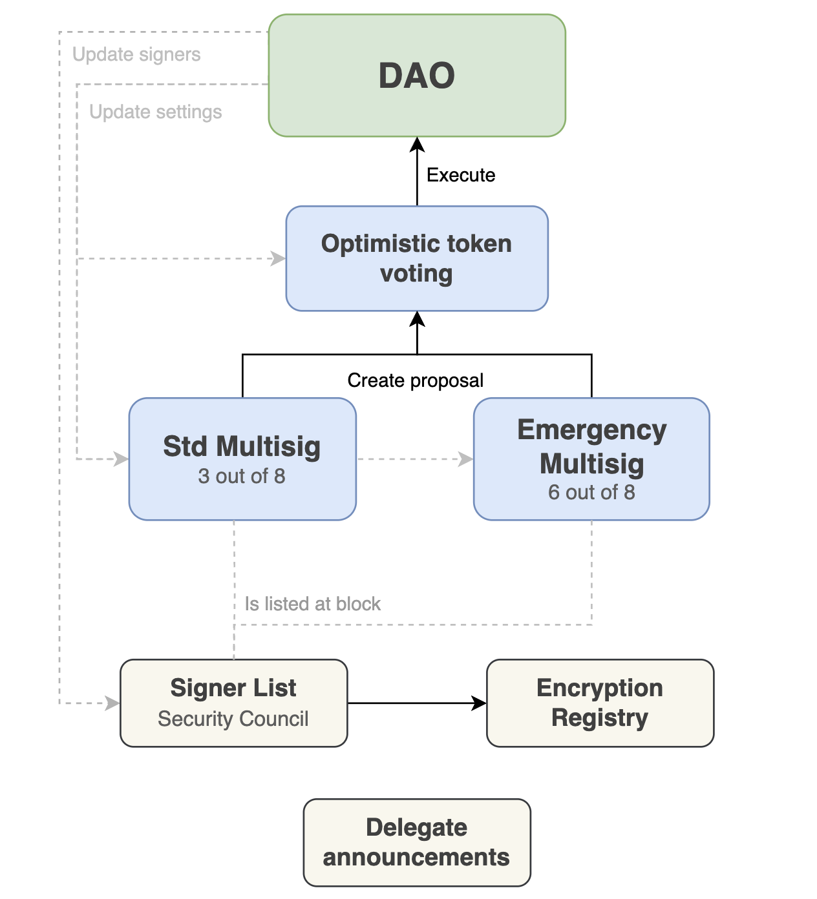
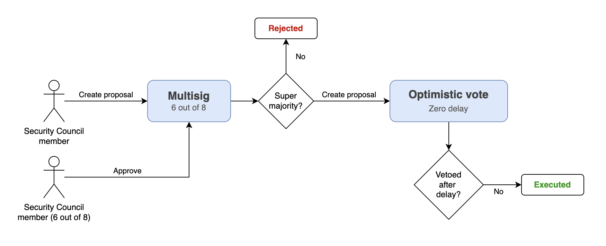

# Taiko DAO contracts

This reposity contains the codebase of the Taiko DAO, along with its 3 plugins and helper contracts. 

The DAO contract is an [Aragon DAO](https://github.com/aragon/osx), on which an **Optimistic Token Voting plugin** has the permission to execute proposals. Proposals on this plugin can only be created by two distinct multisig plugins, belonging to Taiko's Security Council.



The Security Council operates a standard multisig plugin and an emergency variant. The standard Multisig is designed to be the place where DAO proposals start their journey. Any signer can submit a new proposal to the Security Council. After a certain approval ratio is reached, the proposal will be forwarded to the Optimistic voting plugin, where the community will need to ratify it.

The Emergency Multisig, is meant to only be used under exceptional circumstances, i.e. when a critical vulnerability needs to be addressed immediately. Any signer can submit proposals as well, but these proposals will need to be approved by a super majority before they can be executed directly on the DAO. 

Another key difference is that the Emergency Multisig is designed such in a way that the human readable description and the actions are private to the signers until the proposal is finally executed. 

[Learn more about Aragon OSx](#protocol-overview).

See [Deploying the DAO](#deploying-the-dao) below and check out the [contract deployments](./DEPLOYMENTS.md).

## Contracts overview

### Optimistic Token Voting plugin

This plugin is an adapted version of Aragon's [Optimistic Token Voting plugin](https://github.com/aragon/optimistic-token-voting-plugin). 

Only addresses that have been granted `PROPOSER_PERMISSION_ID` on the plugin can create proposals. These adresses belong to the two multisig's governed by the Security Council. 

Proposals can only be executed when the veto threshold hasn't been reached after a given period of time.

The governance settings need to be defined when the plugin is installed but the DAO can update them at any time.

#### Permissions

- Only proposers can create proposals on the plugin
- The plugin can execute actions on the DAO
- The DAO can update the plugin settings
- The DAO can upgrade the plugin

### Multisig (standard flow)

It allows the Security Council members to create and approve proposals. After a certain minimum of approvals is met, proposals can be relayed to the [Optimistic Token Voting plugin](#optimistic-token-voting-plugin) only.

The list of signers for this plugin is taken from SignerList contract. Any changes on it will effect both plugin instances. 

The ability to relay proposals to the [Optimistic Token Voting plugin](#optimistic-token-voting-plugin) is restricted by a [permission condition](src/conditions/StandardProposalCondition.sol), which ensures that a minimum veto period is defined as part of the parameters. 


#### Permissions

- Only members can create proposals
- Only members can approve
- The plugin can only create proposals on the [Optimistic Token Voting plugin](#optimistic-token-voting-plugin) provided that the `duration` is equal or greater than the minimum defined
- The DAO can update the plugin settings

### Emergency Multisig

Like before, this plugin allows Security Council members to create and approve proposals. If a super majority approves, proposals can be relayed to the [Optimistic Token Voting plugin](#optimistic-token-voting-plugin) with a delay period of potentially 0. This is, being executed immediately. 

The list of signers for this plugin is taken from SignerList contract. Any changes on it will effect both plugin instances. 

There are two key differences with the standard Multisig:
1. The proposal's metadata and the actions to execute are encrypted, only the Security Council members have the means to decrypt them
2. When the proposal is executed, the metadata and the actions become publicly visible on the [Optimistic Token Voting plugin](#optimistic-token-voting-plugin). There is an integrity check to prevent any changes to the originally approved content.



#### Permissions

The Emergency Multisig settings are the same as for the standard Multisig. 

- Only members can create proposals
- Only members can approve
- The plugin can only create proposals on the [Optimistic Token Voting plugin](#optimistic-token-voting-plugin) provided that the `duration` is equal or greater than the minimum defined
- The DAO can update the plugin settings

### Signer List

Both multisigs relate to this contract to determine if an address was listed at a certain block. It allows to read the state and manage the address list given that the appropriate permissions are granted.

It also plays an important role regarding encryption, this is why it is coupled with the Encryption Registry (see below). 

It offers convenience methods to determine 3 potential states for a given address:
- An address was a listed signer at a given past block (owner)
- An address is appointed by another address, listed at a past block (appointed)
- An address not listed or appointed

### The encryption challenge

Smart wallets cannot possibly generate a private key, which means that encryption and decryption is unviable. To this end, the [EncryptionRegistry](#encryption-registry) (see below) allows listed signers to **appoint** an EOA to act on behalf of them. 

This means that the Security Council could include a member who was an organization, and such organiation could have a smart wallet. This smart wallet would then appoint one of its members' EOA, so that emergency proposals could be reviewed, approved and eventually executed.

If at any point, the member's EOA became compromised or the member left the team, the smart wallet could then appoint a new EOA and continue without impacting the rest of the Security Council.

What it means:
- Owners (listed signers)
  - Can always create emergency multisig proposals
  - Can only approve if they are not appointing another address
- Addresses appointed by a listed signer
  - Can create emergency proposals
  - Can approve
  - Can execute (they can decrypt the actions and the metadata)

### Encryption Registry

This is a helper contract that allows Security Council members ([SignerList](#signer-list) addresses) to register the public key of their deterministic ephemeral wallet. The available public keys will be used to encrypt the proposal metadata and actions.

Given that smart contracts cannot possibly sign or decrypt data, the encryption registry allows to appoint an EOA as the end target for encryption purposes. This is useful for organizations not wanting to rely on just a single wallet.

Refer to the UI repository for the encryption details.

### Delegation Wall

This is a very simple contract that serves the purpose of storing the IPFS URI's pointing to the delegation profile posted by all candidates. Profiles can be updated by the owner and read by everyone.

### Installing plugins to the DAO

#### Installing the initial set of plugins on the DAO

This is taken care by the [TaikoDAOFactory](src/factory/TaikoDaoFactory.sol) contract. It is invoked by [scripts/Deploy.s.sol](script/Deploy.s.sol) and it creates a holistic, immutable DAO deployment, given some settings. To create a new DAO with new settings, a new factory needs to be deployed. 

#### Installing plugins on the existing DAO

Plugin changes need a proposal to be passed when the DAO already exists.

There are two steps, a permissionless **preparation** and a privileged **application**. 

1. Calling `pluginSetupProcessor.prepareInstallation()`
   - A new plugin instance is deployed with the desired settings
   - The call stores the request of a set of permissions
2. A proposal is passed to make the DAO call `applyInstallation()` on the [PluginSetupProcessor](https://devs.aragon.org/docs/osx/how-it-works/framework/plugin-management/plugin-setup/)
   - This applies the requested permissions and the plugin becomes installed

See [OptimisticTokenVotingPluginSetup](src/setup/OptimisticTokenVotingPluginSetup.sol).

[Learn more about plugin setup's](https://devs.aragon.org/docs/osx/how-it-works/framework/plugin-management/plugin-setup/) and [preparing installations](https://devs.aragon.org/docs/sdk/examples/client/prepare-installation).


## Setup

To get started, ensure that [Foundry](https://getfoundry.sh/) and [Make](https://www.gnu.org/software/make/) are installed on your computer.

### Using the Makefile

The `Makefile` is the target launcher of the project. It's the recommended way to work with it. It manages the env variables of common tasks and executes only the steps that require being run.

```
$ make 
Available targets:

- make init       Check the dependencies and prompt to install if needed
- make clean      Clean the build artifacts

- make test            Run unit tests, locally
- make test-coverage   Generate an HTML coverage report under ./report

- make sync-tests       Scaffold or sync tree files into solidity tests
- make check-tests      Checks if solidity files are out of sync
- make markdown-tests   Generates a markdown file with the test definitions rendered as a tree

- make pre-deploy-mint-testnet   Simulate a deployment to the testnet, minting test token(s)
- make pre-deploy-testnet        Simulate a deployment to the testnet
- make pre-deploy-prodnet        Simulate a deployment to the production network

- make deploy-testnet        Deploy to the testnet and verify
- make deploy-prodnet        Deploy to the production network and verify

- make refund   Refund the remaining balance left on the deployment account
```

Run `make init`:
- It ensures that Foundry is installed
- It runs a first compilation of the project
- It copies `.env.example` into `.env` and `.env.test.example` into `.env.test`

Next, customize the values of `.env` and optionally `.env.test`.

### Understanding `.env.example`

The env.example file contains descriptions for all the initial settings. You don't need all of these right away but should review prior to fork tests and deployments

## Deployment

Deployments are done using the deployment factory. This is a singleton contract that will:

- Deploy all contracts
- Set permissions
- Transfer ownership to a freshly deployed multisig
- Store the addresses of the deployment in a single source of truth that can be queried at any time.

Check the available make targets to simulate and deploy the smart contracts:

```
- make pre-deploy-testnet    Simulate a deployment to the defined testnet
- make pre-deploy-prodnet    Simulate a deployment to the defined production network
- make deploy-testnet        Deploy to the defined testnet network and verify
- make deploy-prodnet        Deploy to the production network and verify
```

### Deployment Checklist

- [ ] I have cloned the official repository on my computer and I have checked out the corresponding branch
- [ ] I am using the latest official docker engine, running a Debian Linux (stable) image
  - [ ] I have run `docker run --rm -it -v .:/deployment debian:bookworm-slim`
  - [ ] I have run `apt update && apt install -y make curl git vim neovim bc`
  - [ ] I have run `curl -L https://foundry.paradigm.xyz | bash`
  - [ ] I have run `source /root/.bashrc && foundryup`
  - [ ] I have run `cd /deployment`
  - [ ] I have run `make init`
  - [ ] I have printed the contents of `.env` and `.env.test` on the screen
- [ ] I am opening an editor on the `/deployment` folder, within the Docker container
- [ ] The `.env` file contains the correct parameters for the deployment
  - [ ] I have created a brand new burner wallet with `cast wallet new` and copied the private key to `DEPLOYMENT_PRIVATE_KEY` within `.env`
  - [ ] I have reviewed the target network and RPC URL
  - [ ] I have checked that the JSON file under `MULTISIG_MEMBERS_JSON_FILE_NAME` contains the correct list of signers
  - [ ] I have ensured all multisig members have undergone a proper security review and are aware of the security implications of being on said multisig
  - [ ] I have checked that `MIN_STD_APPROVALS`, `MIN_EMERGENCY_APPROVALS` and `MULTISIG_PROPOSAL_EXPIRATION_PERIOD` are correct
  - [ ] I have verified that `TOKEN_ADDRESS` corresponds to an ERC20 contract on the target chain
  - [ ] I have checked that `TAIKO_L1_ADDRESS` and `TAIKO_BRIDGE_ADDRESS` are correct 
  - The plugin ENS subdomain
    - [ ] Contains a meaningful and unique value
  - The given OSx addresses:
    - [ ] Exist on the target network
    - [ ] Contain the latest stable official version of the OSx DAO implementation, the Plugin Setup Processor and the Plugin Repo Factory
    - [ ] I have verified the values on https://www.npmjs.com/package/@aragon/osx-commons-configs?activeTab=code > `/@aragon/osx-commons-configs/dist/deployments/json/`
- [ ] All my unit tests pass (`make test`)
- **Target test network**
  - [ ] I have run a preview deployment on the testnet
    - `make pre-deploy-mint-testnet`
  - [ ] I have deployed my contracts successfully to the target testnet
    - `make deploy-testnet`
  - [ ] I have tested that these contracts work successfully on a UI
- **Target production network**
    - [ ] I have updated `TOKEN_ADDRESS` to have the address of the testnet token deployed above
    - [ ] I have checked that `TAIKO_L1_ADDRESS` and `TAIKO_BRIDGE_ADDRESS` are correct 
- [ ] My deployment wallet is a newly created account, ready for safe production deploys.
- My computer:
  - [ ] Is running in a safe physical location and a trusted network
  - [ ] It exposes no services or ports
  - [ ] The wifi or wired network used does does not have open ports to a WAN
- [ ] I have previewed my deploy without any errors
  - `make pre-deploy-prodnet`
- [ ] My wallet has sufficient native token for gas
  - At least, 15% more than the estimated simulation
- [ ] Unit tests still run clean
- [ ] I have run `git status` and it reports no local changes
- [ ] The current local git branch corresponds to its counterpart on `origin`
  - [ ] I confirm that the rest of members of the ceremony pulled the last commit of my branch and reported the same commit hash as my output for `git log -n 1`
- [ ] I have initiated the production deployment with `make deploy-prodnet`

### Post deployment checklist

- [ ] The deployment process completed with no errors
- [ ] The deployed factory was deployed by the deployment address
- [ ] The reported contracts have been created created by the newly deployed factory
- [ ] The smart contracts are correctly verified on Etherscan or the corresponding block explorer
- [ ] The output of the latest `deployment-*.log` file corresponds to the console output
- [ ] I have transferred the remaining funds of the deployment wallet to the address that originally funded it
  - `make refund`

### Manual from the command line

You can of course run all commands from the command line:

```sh
# Load the env vars
source .env
```

```sh
# run unit tests
forge test --no-match-path "test/fork/**/*.sol"
```

```sh
# Set the right RPC URL
RPC_URL="https://eth-sepolia.g.alchemy.com/v2/${ALCHEMY_API_KEY}"
```

```sh
# Run the deployment script

# If using Etherscan
forge script --chain "$NETWORK" script/DeployGauges.s.sol:Deploy --rpc-url "$RPC_URL" --broadcast --verify

# If using BlockScout
forge script --chain "$NETWORK" script/DeployGauges.s.sol:Deploy --rpc-url "$RPC_URL" --broadcast --verify --verifier blockscout --verifier-url "https://sepolia.explorer.mode.network/api\?"
```

If you get the error Failed to get EIP-1559 fees, add `--legacy` to the command:

```sh
forge script --chain "$NETWORK" script/DeployGauges.s.sol:Deploy --rpc-url "$RPC_URL" --broadcast --verify --legacy
```

If some contracts fail to verify on Etherscan, retry with this command:

```sh
forge script --chain "$NETWORK" script/DeployGauges.s.sol:Deploy --rpc-url "$RPC_URL" --verify --legacy --private-key "$DEPLOYMENT_PRIVATE_KEY" --resume
```


## OSx protocol overview

OSx [DAO's](https://github.com/aragon/osx/blob/develop/packages/contracts/src/core/dao/DAO.sol) are designed to hold all the assets and rights by themselves. On the other hand, plugins are custom opt-in pieces of logic that can implement any type of governance. They are meant to eventually make the DAO execute a certain set of actions.

The whole ecosystem is governed by the DAO's permission database, which is used to restrict actions to only the role holding the appropriate permission.

### How permissions work

An Aragon DAO is a set of permissions that are used to define who can do what, and where.

A permission looks like:

- An address `who` holds `MY_PERMISSION_ID` on a target contract `where`

Brand new DAO's are deployed with a `ROOT_PERMISSION` assigned to its creator, but the DAO will typically deployed by the DAO factory, which will install all the requested plugins and drop the ROOT permission after the set up is done.

Managing permissions is made via two functions that are called on the DAO:

```solidity
function grant(address _where, address _who, bytes32 _permissionId);

function revoke(address _where, address _who, bytes32 _permissionId);
```

### Permission Conditions

For the cases where an unrestricted permission is not derisable, a [Permission Condition](https://devs.aragon.org/osx/how-it-works/core/permissions/conditions) can be used.

Conditional permissions look like this:

- An address `who` holds `MY_PERMISSION_ID` on a target contract `where`, only `when` the condition contract approves it

Conditional permissions are granted like this:

```solidity
function grantWithCondition(
  address _where,
  address _who,
  bytes32 _permissionId,
  IPermissionCondition _condition
);
```

See the condition contract boilerplate. It provides the plumbing to easily restrict what the different multisig plugins can propose on the OptimisticVotingPlugin.

[Learn more about OSx permissions](https://devs.aragon.org/osx/how-it-works/core/permissions/#permissions)

### Permissions being used

Below are all the permissions that a [PluginSetup](#plugin-setup-contracts) contract may want to request:

- `EXECUTE_PERMISSION` is required to make the DAO `execute` a set of actions
  - Only governance plugins should have this permission
- `ROOT_PERMISSION` is required to make the DAO `grant` or `revoke` permissions
  - The DAO needs to be ROOT on itself (it is by default)
  - Nobody else should be ROOT on the DAO
- `UPGRADE_PLUGIN_PERMISSION` is required for an address to be able to upgrade a plugin to a newer version published by the developer
  - Typically called by the DAO via proposal
  - Optionally granted to an additional address for convenience
- `PROPOSER_PERMISSION` is required to be able to create optimistic proposals on the governance plugin
- `UPDATE_MULTISIG_SETTINGS_PERMISSION_ID` is used by the DAO to update the settings of a multisig plugin, if the community approves
- `UPDATE_OPTIMISTIC_GOVERNANCE_SETTINGS_PERMISSION_ID` is used by the DAO to update the settings of the optimistic voting plugin, if the community approves

Other DAO specific permissions:

- `UPGRADE_DAO_PERMISSION`
- `SET_METADATA_PERMISSION`
- `SET_TRUSTED_FORWARDER_PERMISSION`
- `SET_SIGNATURE_VALIDATOR_PERMISSION`
- `REGISTER_STANDARD_CALLBACK_PERMISSION`

### Encoding and decoding actions

Making calls to the DAO is straightforward, however making execute arbitrary actions requires them to be encoded, stored on chain and be approved before they can be executed.

To this end, the DAO has a struct called `Action { to, value, data }`, which will make the DAO call the `to` address, with `value` ether and call the given calldata (if any). Such calldata is an ABI encoded array of bytes with the function to call and the parameters it needs. 

### DO's and DONT's

- Never grant `ROOT_PERMISSION` unless you are just trying things out
- Never uninstall all plugins, as this would brick your DAO
- Ensure that there is at least always one plugin with `EXECUTE_PERMISSION` on the DAO
- Ensure that the DAO is ROOT on itself
- Use the `_gap[]` variable for upgradeable plugins, as a way to reserve storage slots for future plugin implementations
  - Decrement the `_gap` number for every new variable (slot) you add in the future

### Plugin upgradeability

By default, only the DAO can upgrade plugins to newer versions. This requires passing a proposal.

[Learn more about plugin upgrades](https://devs.aragon.org/docs/osx/how-to-guides/plugin-development/upgradeable-plugin/updating-versions)

## Development

To work with the repository you need to install [Foundry](https://book.getfoundry.sh/getting-started/installation) on your operating system.

### Build

```shell
$ forge build
```

### Test

```shell
$ forge test
```

### Formatting the code

```shell
$ forge fmt
```

### Gas Snapshots

```shell
$ forge snapshot
```

### Run a local test EVM

```shell
$ anvil
```

### Cast

```shell
$ cast <subcommand>
```

## Deployment

### Deploying the DAO

1. Edit `script/multisig-members.json` with the list of addresses to set as signers
2. Run `forge build && forge test`
3. Copy `.env.example` into `.env` and define the settings
4. Run `source .env` to load them
5. Set the RPC URL and run the deployment script

```shell
RPC_URL="https://eth-holesky.g.alchemy.com/v2/${ALCHEMY_API_KEY}"
forge script --chain "$NETWORK" script/Deploy.s.sol:Deploy --rpc-url "$RPC_URL" --broadcast --verify
```

If you get the error `Failed to get EIP-1559 fees`, add `--legacy` to the last command:

```shell
forge script --chain "$NETWORK" script/Deploy.s.sol:Deploy --rpc-url "$RPC_URL" --broadcast --verify --legacy
```

If a some contracts fail to verify on Etherscan, retry with this command:

```shell
forge script --chain "$NETWORK" script/Deploy.s.sol:Deploy --rpc-url "$RPC_URL" --verify --legacy --private-key "$DEPLOYMENT_PRIVATE_KEY" --resume
```

## Testing

See the [test tree](./TEST_TREE.md) file for a visual representation of the implemented tests.

Tests can be described using yaml files. They will be automatically transformed into solidity test files with [bulloak](https://github.com/alexfertel/bulloak).

Create a file with `.t.yaml` extension within the `test` folder and describe a hierarchy of test cases:

```yaml
# MyTest.t.yaml

MultisigTest:
- given: proposal exists
  comment: Comment here
  and: 
  - given: proposal is in the last stage
    and:

    - when: proposal can advance
      then:
      - it: Should return true

    - when: proposal cannot advance
      then:
      - it: Should return false

  - when: proposal is not in the last stage
    then:
    - it: should do A
      comment: This is an important remark
    - it: should do B
    - it: should do C

- when: proposal doesn't exist
  comment: Testing edge cases here
  then:
  - it: should revert
```

Then use `make` to automatically sync the described branches into solidity test files.

```sh
$ make
Available targets:
- make all        Builds all tree files and updates the test tree markdown
- make sync       Scaffold or sync tree files into solidity tests
- make check      Checks if solidity files are out of sync
- make markdown   Generates a markdown file with the test definitions rendered as a tree
- make init       Check the dependencies and prompt to install if needed
- make clean      Clean the intermediary tree files

$ make sync
```

The final output will look like a human readable tree:

```
# MyTest.tree

EmergencyMultisigTest
├── Given proposal exists // Comment here
│   ├── Given proposal is in the last stage
│   │   ├── When proposal can advance
│   │   │   └── It Should return true
│   │   └── When proposal cannot advance
│   │       └── It Should return false
│   └── When proposal is not in the last stage
│       ├── It should do A // Careful here
│       ├── It should do B
│       └── It should do C
└── When proposal doesn't exist // Testing edge cases here
    └── It should revert
```
